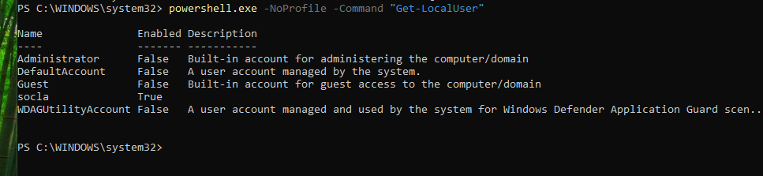
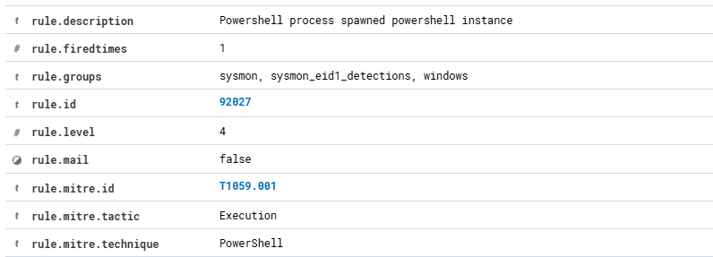

# Scenario 01 — PowerShell Local Account Enumeration

## Overview

This investigation demonstrates the detection and analysis of PowerShell-based local account enumeration on a monitored Windows 11 endpoint.

The activity was generated in a controlled SOC lab and captured using Sysmon before being forwarded to Wazuh for detection and investigation.

---

## Environment

| Component | Role |
|---|---|
| SOC-WINDOWS-01 | Windows 11 monitored endpoint |
| Sysmon | Endpoint telemetry collection |
| Wazuh Agent | Event forwarding |
| Wazuh Manager | SIEM analysis and alerting |
| Kali Linux | Controlled attacker system |

---

## Activity

The following PowerShell command was executed on the Windows endpoint:

```powershell
powershell.exe -NoProfile -Command "Get-LocalUser"
```

The command enumerates local user accounts configured on the Windows host.



---

## Detection

Sysmon captured the PowerShell process creation activity and forwarded the resulting telemetry through the Wazuh agent.

Wazuh generated the following alert:

- **Rule ID:** 92027
- **Rule Level:** 4
- **Description:** Powershell process spawned powershell instance
- **MITRE ATT&CK ID:** T1059.001
- **Technique:** PowerShell
- **Tactic:** Execution


---

## MITRE ATT&CK Mapping

Wazuh automatically mapped the detection to:

**T1059.001 — PowerShell**

The underlying command also performs local account enumeration.

From an analyst perspective, this behaviour is consistent with:

**T1087.001 — Account Discovery: Local Account**

This demonstrates why SIEM-generated classifications should be validated against the underlying command and surrounding telemetry.



---

## Analyst Assessment

The alert confirms that PowerShell was launched from an existing PowerShell process.

Review of the command line identified:

```text
Get-LocalUser
```

This command can be used legitimately by administrators, but it may also be used during post-compromise reconnaissance to identify local accounts on a system.

The alert should therefore be investigated in context rather than automatically classified as malicious.

---

## Investigation Steps

The investigation would include:

1. Identify the affected endpoint and user.
2. Review the complete PowerShell command line.
3. Examine the parent and child process chain.
4. Review surrounding Sysmon events.
5. Check for additional discovery commands.
6. Review authentication activity.
7. Correlate endpoint and network telemetry.
8. Determine whether the activity was authorised.

---

## Response Considerations

If the activity were unauthorised, potential response actions would include:

- Isolate the affected endpoint.
- Terminate suspicious processes.
- Review the affected user account.
- Search for related activity across other endpoints.
- Preserve relevant telemetry.
- Escalate the incident for further investigation.

---

## Outcome

This scenario validated the end-to-end SOC telemetry pipeline:

```text
PowerShell Activity
        ↓
Sysmon
        ↓
Windows Event Log
        ↓
Wazuh Agent
        ↓
Wazuh Manager
        ↓
Detection Rule
        ↓
Threat Hunting
        ↓
Analyst Investigation
```

The exercise demonstrated practical experience in endpoint telemetry analysis, SIEM alert triage, MITRE ATT&CK mapping, and SOC investigation methodology.